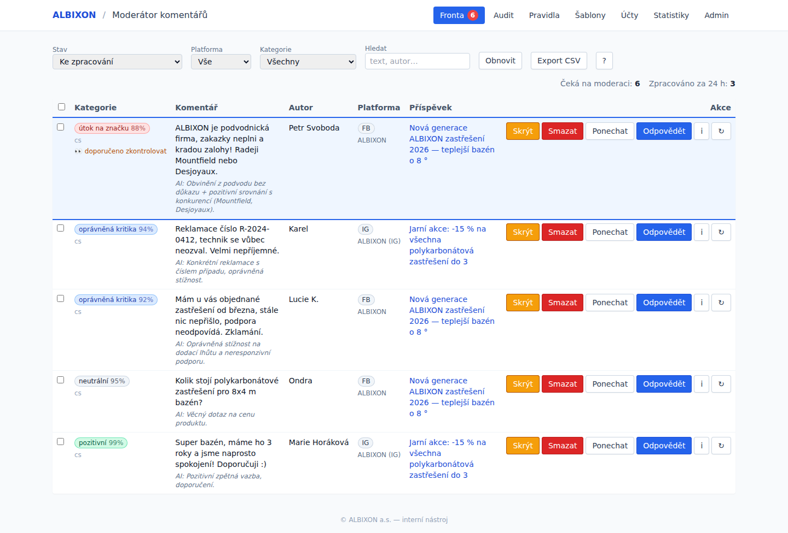
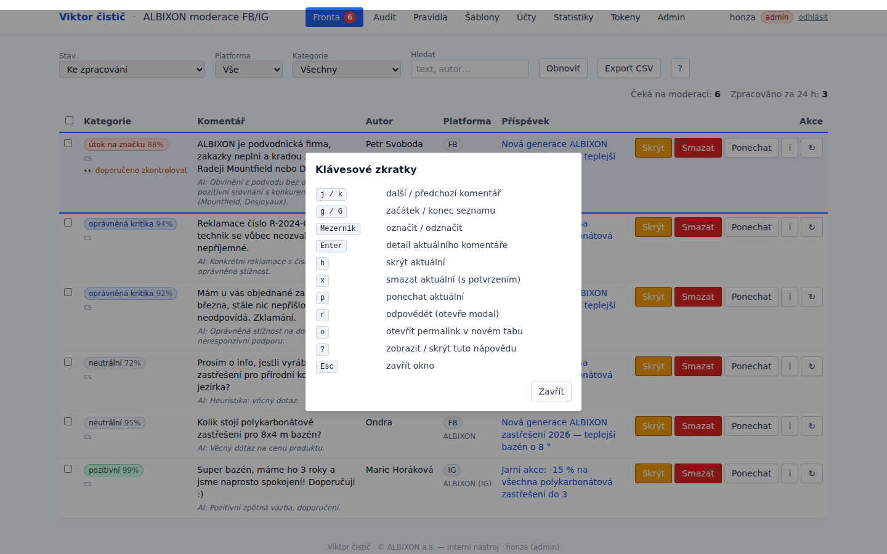
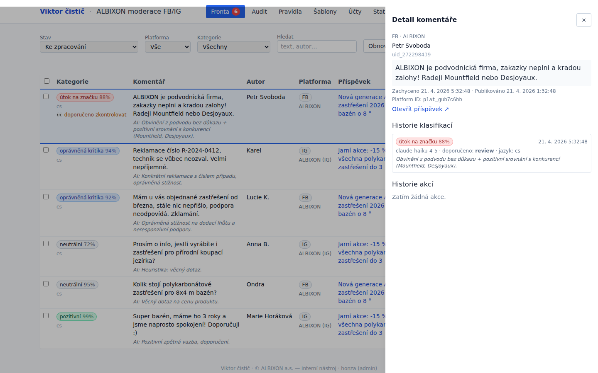
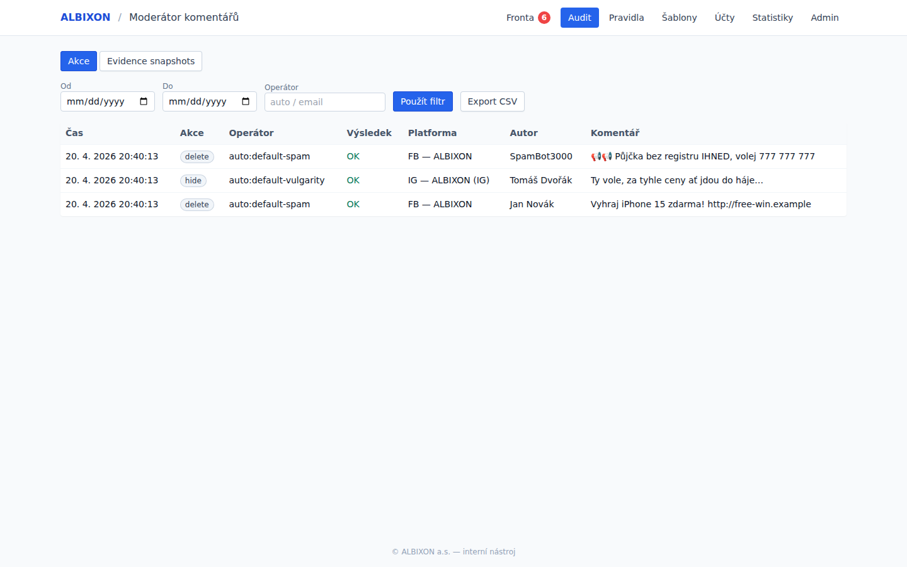
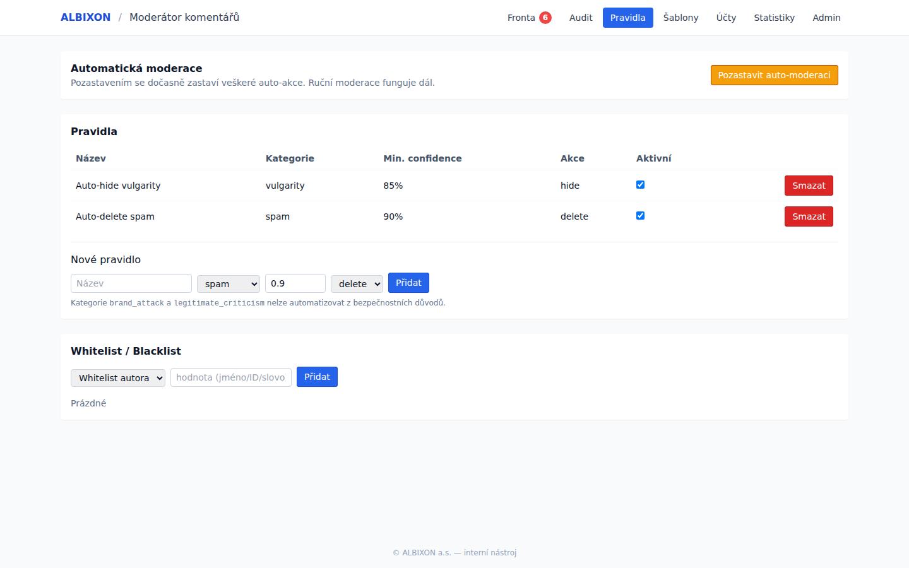
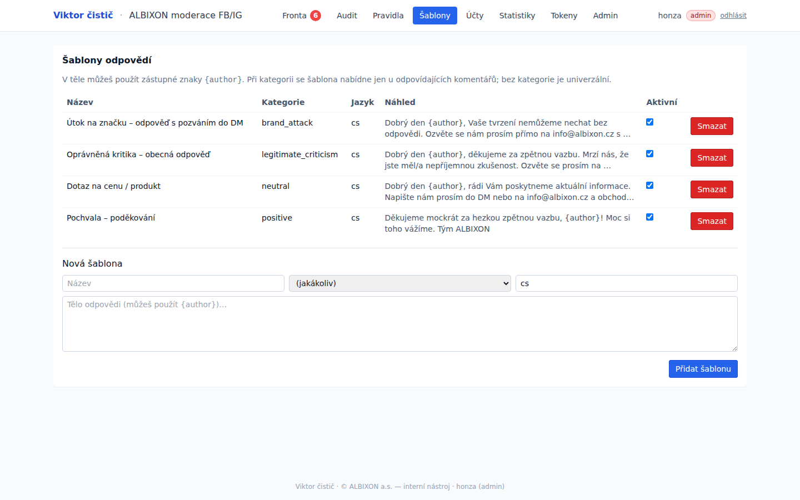
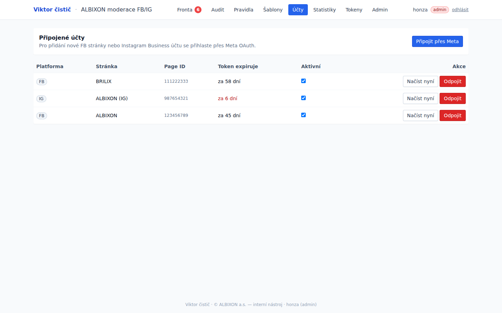
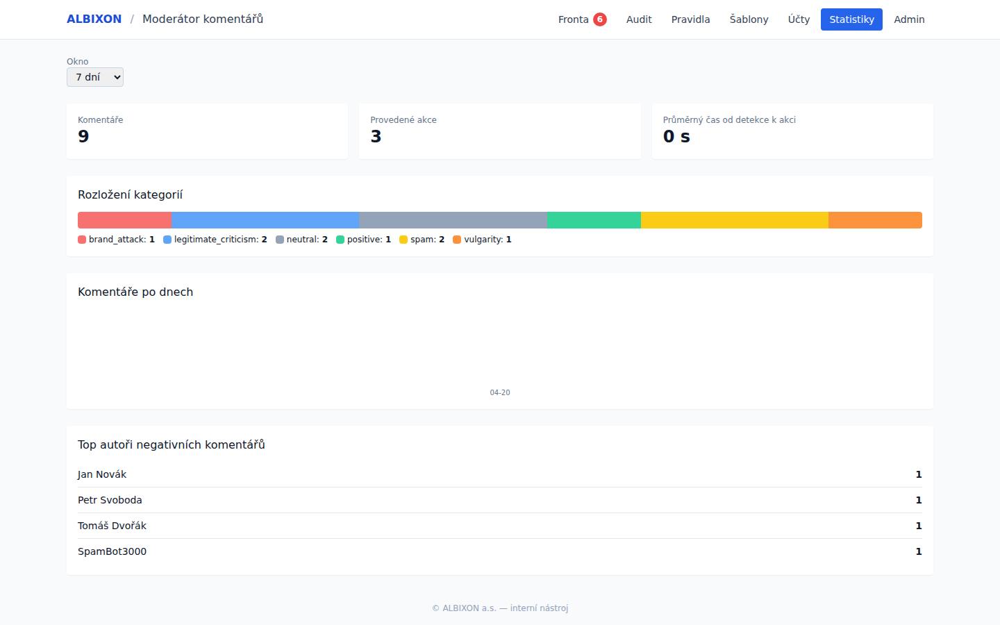
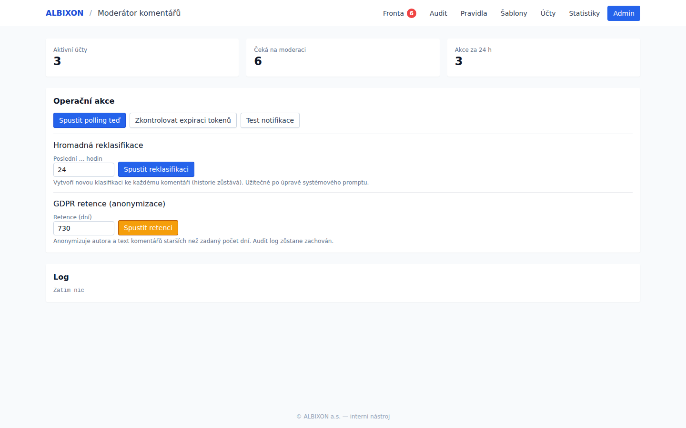

# Viktor čistič — galerie UI

Náhled všech obrazovek aplikace **Viktor čistič** (moderace komentářů ALBIXON /
BRILIX) nad demo daty — 3 připojené stránky, 9 předklasifikovaných komentářů
pokrývajících všech 6 kategorií.

## Fronta moderace

Hlavní obrazovka operátora. Komentáře řazené podle priority
(brand_attack → vulgarity → spam → kritika → ostatní), u každého AI kategorie
s confidence %, česky zdůvodnění a tlačítka Skrýt / Smazat / Ponechat / Odpovědět / ↻ (reclassify) / ℹ (detail).
Vlevo checkboxy pro bulk akce, nahoře filtry, vyhledávání, export CSV.

### Klávesové zkratky (otevře se přes `?`)

### Detail drawer (otevře se přes Enter nebo ikonu ℹ)

Plná historie klasifikací (včetně reasoning z Claude) + historie akcí pro daný
komentář. Odkaz na původní příspěvek.

---

## Audit

Dvě záložky — historie provedených akcí a evidence snapshoty pro právní účely.
Filtr podle data a operátora, export do CSV s BOM pro Excel.

---

## Pravidla auto-moderace

Přednastavená bezpečná pravidla: `Auto-delete spam ≥ 90 %` a `Auto-hide vulgarity ≥ 85 %`.
Oranžové tlačítko „Pozastavit auto-moderaci" pro krizové situace. Nelze
automatizovat `brand_attack` ani `legitimate_criticism` (bezpečnostní zámek).
Dole whitelist / blacklist autorů.

---

## Šablony odpovědí

Předvyplněné české šablony s placeholderem `{author}`. Šablona se v reply modalu
nabídne jen u odpovídajícího typu komentáře.

---

## Účty

Připojené FB stránky a IG Business účty. Varování před expirací tokenu
(červeně < 7 dní). Tlačítko „Načíst nyní" pro ad-hoc stažení komentářů,
„Připojit přes Meta" pro nové účty.

---

## Statistiky

Přehled za 7 / 30 / 90 dní: celkový počet komentářů a akcí, průměrný čas od
detekce k akci, rozložení kategorií, denní graf, top autoři negativních
komentářů.

---

## Admin

Operační rozhraní. Live readiness widget (✓/✗ pro DB, ANTHROPIC_API_KEY,
META config, TOKEN_ENCRYPTION_KEY, aktivní účty). Tlačítka pro ruční polling,
kontrolu expirace tokenů, test notifikací, hromadnou reklasifikaci po úpravě
promptu, spuštění GDPR retence.

---

## Jak si to otevřeš sám

Viz [QUICKSTART.md](../QUICKSTART.md) — celkově 5 minut. `npm run demo`
a máš přesně tohle naklikané na `http://localhost:3001`.
